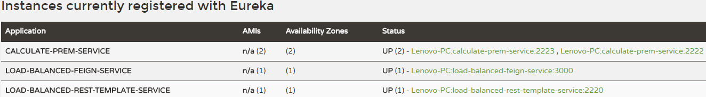

# spring-microservices

### 操作方式
- 先啟動 eureka-server，啟動後進入 [eureka server 管理介面](http://localhost:1111/)，目前尚未有任何的 instance 註冊
- 啟動 calculate-prem-client、calculate-prem-client2、load-balanced-clien-feign、load-balanced-clien-rest-template
 ，啟動完後重新整理 [eureka server 管理介面](http://localhost:1111/) 會看到已註冊 4 個 instance

- LOAD-BALANCED-FEIGN-SERVICE: [http://localhost:2220/calculate/3/6](http://localhost:2220/calculate/3/6)
- LOAD-BALANCED-REST-TEMPLATE-SERVICE: [http://localhost:3000/calculate/3/6](http://localhost:2220/calculate/3/6)
- 每次重新整理會看到是從不同的 CALCULATE-PREM-SERVICE 計算出保費

### Introduction
- 主要對外開放 API 都是 LOAD-BALANCE 的 service
- 透過 Spring 的 LOAD-BALANCE 演算會再決定進入哪隻 CALCULATE-PREM-SERVICE
- LOAD-BALANCED-FEIGN 是用 @FeignClient 直接註冊對應的 service instance name，預設就有 LOAD-BALANCE 的機制
- LOAD-BALANCED-REST-TEMPLATE 是用 RestTemplate 採用 rest 方式再去找對應的 service instance，這個 RestTemplate 有註冊成
 @LoadBalanced，所以也有 LOAD-BALANCE 的機制，但此 Server 尚未套用 Spring Cloud 的 Hystrix 進行錯誤處理，如果一台
 CALCULATE-PREM-SERVICE shutdown 了目前有可能會出錯，LOAD-BALANCED-FEIGN 目前則不會有此問題